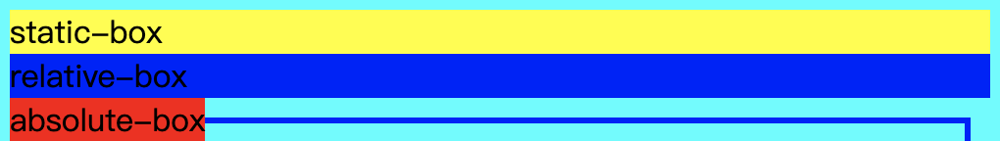

# position
## static 普通文档流默认值
## relative 相对定位：
相对最近的一个包含块的位置,使用top bottom left right来调整当前元素相对包含块的相对位置（top:30px;即距离包含块的顶部30px的位置）
## absolute 绝对定位：
绝对定位脱离了普通文档流,默认情况下，块级元素的内容宽度是其父元素的宽度的 100％，并且与其内容一样高。但绝对定位脱离了文档流后其就宽度等于自身的内容宽度，如下面这个例子:
```html
<body>
    <div class="static-box">static-box</div>
    <div class="relative-box">relative-box</div>
    <div class="absolute-box">absolute-box</div>
<body>

<style lang="text/css">
    body{
        width: 500px;
        margin: 0 auto;
        background-color: aqua;
    }
    .relative-box{
        background-color: yellow;
    }
    .relative-box{
        background-color: blue;
    }
    .absolute-box{
        background-color: red;
    }
</style>
```
这个特性适合块级元素在未知宽度时，能做到其在最近的position包含块中保持水平垂直居中。


多个绝对定位元素重叠时可以使用```z-index```改变自身的层级，从而达到覆盖其他绝对定位元素或者被其他绝对定位元素。

虽然是叫绝对定位其本质也是相对于浏览器viewport或者最近的position不为```static```的包含块(通常为```relative```为了保持包含块原来的布局)

但是当启用了绝对定位，块级元素的内容宽度就不再是其父元素的宽度的100%了，而是其自身内容的宽高，尤其是在块级元素没有指定宽高的情况下。

## fixed 固定定位：
和绝对定位的差异就在于其仅相对viewport的位置

## sticky:
相对定位与固定定位的结合体：top buttom left right 等属性设置后，当元素达到指定位置就固定下来，没有达到指定位置就表现为相对定位。
