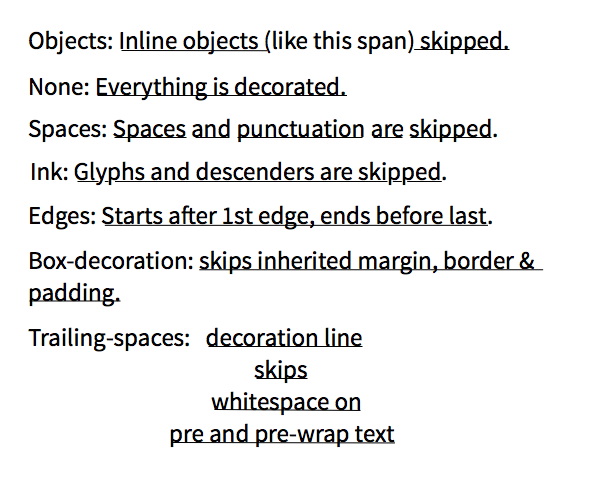

# text-overflow:ellipsis [文本省略]
## single-line ellipsis
```css
.single-line-text{
    overflow:hidden;
    text-overflow:ellipsis;
    white-space:nowrap;
}
```

## multi-line ellipsis
```css
.multi-line-text{
    overflow:hidden;
    text-overflow:ellipsis;
    display:-webkit-box;//
    -webkit-line-clamp:2;//
    -webkit-box-orient: vertical;//
}
```
## float multi-line ellipsis
[float 实现多行省略文本]([url](https://www.jianshu.com/p/3bce7924a466))

# direction [文本阅读方向]
```css
.text-direction{
    direction:rtl;//default：ltr 从左往右 rtl 从右向左
}
```
Equals to
```html
<p dir="rtl">text right to left</p>
```
# text-align [文本对齐方式]
```css
.text-left{
    text-align:left;//left right center justify start end inherit
}
```
- left:左对齐
- rigjt:右对齐
- center:居中对齐
- justify:两端对齐，最后一行是做对齐
- inherit:继承父元素的值
- start:direction熟悉ltr左对齐，否则右对齐
- end:与上述相反
# vertical-align [文本垂直对齐方式]
常见的垂直居中
```css
.text-vertical{
    vertical-align:middle;
}
```
- baseline:默认值，对齐父元素的基线（[什么是基线？](https://zhuanlan.zhihu.com/p/30169829)）
- top:
- bottom:
- middle:
- text-top:
- text-bottom:
- sub:垂直对齐文本的下标志
- super:垂直对齐文本的上标志
- length:升高或降低特定的长度，可使用负值
- %:使用line-height属性的百分比来排列词元素（w3c说明不使用负值，在谷歌浏览器实际操作是可以为负数）
- inherit:

##  reference : [w3school-vertical-align](https://www.w3school.com.cn/cssref/pr_pos_vertical-align.asp)
# word wrap
```css
.wordwrap{
    word-wrap:break-word;
}
```
- normal
- break-word
# word break
```css
.wordbreak{
    word-break:keep-all;
}
```
- normal
- break-all
- keep-all
# hyphens[连词器]   
```css
.hy{
    hyphens:manual;
}
```
- none
- manual
- auto
  
[Example](https://www.w3school.com.cn/tiy/t.asp?f=cssref_hyphens)
# text-decoration[文本装饰线]
text-decoration属性值：
- none 无装饰线
- underline 下划线
- overline 上划线 默认1px
- line-through 删除线 默认1px
- inherit 继承父元素的属性 默认1px
```css
.text{
    text-decoration:none;
}
//可以同时存在多种装饰线
.multi{
    text-decoration:underline overline line-through
}
```
text-decoration 由如下属性组成:
- text-decoration-color //装饰线的颜色
- text-decoration-line
- text-decoration-style
- text-decoration-skip
# text-decoration-line[文本装饰线-underline overline etc]

# text-decoration-color[文本装饰线-颜色]

# text-decoration-style[文本装饰线-风格]
属性值：
- solid:实线
- double:双实线
- dotted:虚线
- wavy:波浪线
# text-decoration-skip[文本装饰线-中断]
设置装饰线应该在何处中断
```css
a{
    text-decoration-skip:ink;
}
```

 
 属性值：
- objects:在文本内图片或者其他inline-block对象中断
- none:
- spaces:空格和断词处中断 (google浏览器和safari没效果)
- ink:笔画下降（y）或者上升的字母中断
- edges:装饰线开始和结尾处收缩
- box-decoration:装饰线在继承的margin border和padding处中断
  
## Reference:[css-trick-text-decoration-skip](https://css-tricks.com/almanac/properties/t/text-decoration-skip/#:~:text=The%20text-decoration-skip%20property%20specifies%20where%20a%20text%20underline%2C,text%20and%20corrects%20punctuation%20grammar%20for%20some%20languages.)


# white-space[空格]
html 对空格的处理规则:忽略文本前后的空格，文本内部的的空格只保留一个。

保留空格的方式:

```html
<pre>  white  space  </pre>

<p>&nbsp;&nbsp;white&nbsp;&nbsp;space&nbsp;&nbsp;</p>

<p> white 
    space</p> <!--文本内部的换行符号视为空格 输出 white space -->
<pre>white 
    space
</pre><!--pre文本内部的换行符号有效 -->
```
white-space的属性：
- normal:遵循浏览器的基本规则
- nowrap:超出容器宽度会换行
- pre:遵循pre标签的规则
- pre-wrap:遵循pre标签的规则&超出容器宽度会换行
- pre-line:保留换行符其他遵循normal

